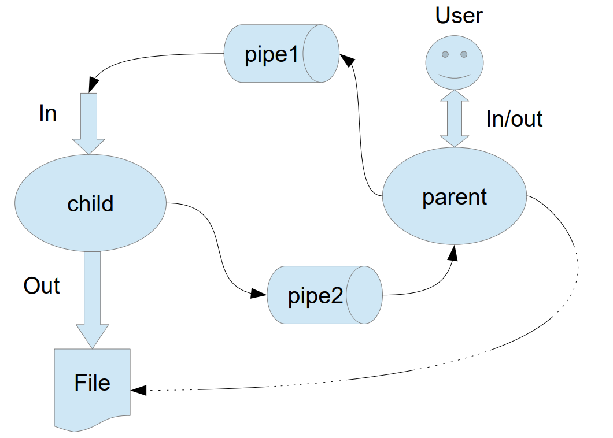

# **Лабораторная работа №1** (Вариант 16)

## Цель работы

Приобретение практических навыков в:

- Управлении процессами в ОС;
- Обеспечении обмена данных между процессами посредством каналов.

## Задание

Составить и отладить программу на языке Си, осуществляющую работу с процессами и взаимодействие между ними в одной из двух операционных систем. В результате работы программа (основной процесс) должен создать для решения задачи один или несколько дочерних процессов. Взаимодействие между процессами осуществляется через системные сигналы/события и/или каналы (pipe). Необходимо обрабатывать системные ошибки, которые могут возникнуть в результате работы.

Родительский процесс создает дочерний процесс. Первой строкой пользователь в консоль родительского процесса вводит имя файла, которое будет использовано для открытия File с таким именем на запись. Перенаправление стандартных потоков ввода-вывода показано на картинке выше. Родительский и дочерний процесс должны быть представлены разными программами. Родительский процесс принимает от пользователя строки произвольной длины и пересылает их в pipe1. Процесс child проверяет строки на валидность правилу. Если строка соответствует правилу, то она выводится в стандартный поток вывода дочернего процесса, иначе в pipe2 выводится информация об ошибке. Родительский процесс полученный от child ошибки выводит в стандартный поток вывода.

**Правило проверки:** строка должна оканчиваться на «.» или «;»

## Справочная информация

### Системные вызовы

#### Для ОС Linux

- `pid_t fork()` - создание дочернего процесса;
- `int execve(const char *filename, char *const argv[], char *const envp[])` (и другие вариации `exec`) - замена образа памяти процесса;
- `pid_t waitpid(pid_t pid, int *status, int options)` - Ожидание завершения дочернего процесса;
- `void exit(int status)` - завершения выполнения процесса и возвращение статуса;
- `int pipe(int pipefd[2])` - создание неименованного канала для передачи данных между процессами;
- `int dup2(int oldfd, int newfd)` - переназначение файлового дескриптора;
- `int open(const char *pathname, int flags, mode_t mode)` - открытие\создание файла;
- `int close(int fd)` - закрыть файл;
- `int mkfifo(const char *pathname, mode_t mode)` - создание именованного канала.

#### Для ОС Windows

- `BOOL WINAPI CreateProcess(…)` - создание нового процесса;
- `WaitForSingleObject(…)` - ожидание завершения процесса;
- `ExitProcess(…)` - завершение выполнения процесса;
- `CreateFile/SetNamedPipeHandleState` - создание именованного канала и установления режима его использования;
- `Int _dup2(int fd1, int fd2)` - переназначение файлового дескриптора;
- `OpenFile(…)` - открытие нового файла;
- `CreatePipe(…)` - создание безымянного канала;
- `CreateFile(…)` - создание нового файла;
- `CloseHandle(…)` - закрытие объекта ОС по "заголовку". Подходит для закрытия файлов.
